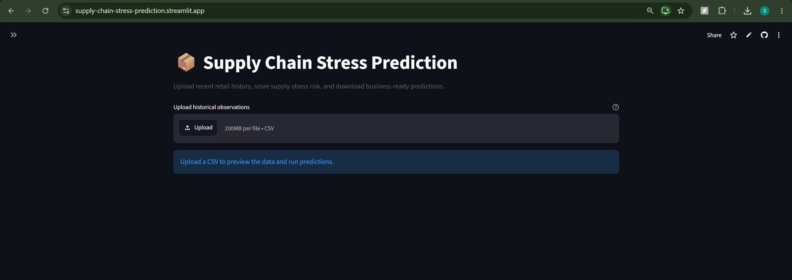
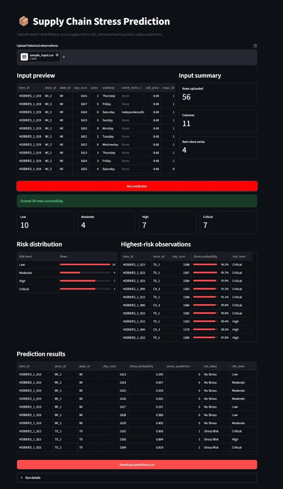

<p align="center">
  
</p>

<p align="center">
  <strong>End-to-end machine learning pipeline for early detection of retail demand stress</strong>
</p>

## 🚀 Live Demo

<p align="center">

<a href="https://supply-chain-stress-prediction.streamlit.app">

</a>

<a href="https://supply-chain-stress-api.onrender.com/docs">

</a>

<a href="https://github.com/suhailyunus/supply-chain-stress-prediction/actions">

</a>

</p>

**Try it yourself**

1. Open the Streamlit application.
2. Upload `examples/sample_input.csv`.
3. Click **Run Prediction**.
4. Review the dashboard.
5. Download `predictions.csv`.


<p align="center">
  
  
  
  
  
</p>

> A production-oriented machine learning application demonstrating how historical retail demand signals can be transformed into an operational early-warning system through automated feature engineering, REST APIs, containerized deployment, and an interactive web interface.

---


## 📸 Application Preview

### Home Screen

<p align="center">

</p>

### Prediction Results

<p align="center">

</p>

---

## Business Problem

Unexpected demand surges can create inventory pressure, stockouts, and lost sales. This project builds an **early-warning system** that ranks item-store observations by their probability of entering a high-demand state associated with potential supply stress.

The solution uses recent sales behavior, short-term volatility, calendar context, pricing, and location signals to produce a reusable risk score.

## Dataset

The project is built using a large-scale retail sales dataset containing historical product demand, pricing information, promotional calendar events, and multi-store geographic information.

These data sources provide a realistic environment for developing machine learning models that identify elevated demand conditions associated with potential supply chain stress.

The dataset is publicly available and widely used for benchmarking retail demand forecasting methods, making it suitable for demonstrating production-oriented machine learning workflows while maintaining reproducibility.

> **Target caveat:** The retail sales dataset used in this project does not contain verified inventory or stockout outcomes. To approximate supply stress, the target is defined as sales exceeding an item-specific 90th percentile demand threshold. The model therefore predicts a transparent high-demand proxy rather than confirmed stockout events.

## Results at a Glance

Stress events occur in **8.85%** of holdout observations. That base rate
is the reference point for everything below: a model that predicts "no
stress" for every row scores **91.15% accuracy** and is useless. Accuracy
is therefore not reported as a headline metric.

**Validation design.** Training covers days 8-1531 (1,208,200 rows);
the holdout covers days 1532-1913 (381,892 rows). No day appears in
both. Every item-store series appears on both sides, so the model is
evaluated on the future of series it has seen - not on unseen items.

### Ranking quality

| Metric | Value | Reference |
|---|---:|---|
| Average precision | **0.2225** | 0.0885 if ranked at random (**2.51x lift**) |
| Precision @ top 100 alerts | **0.520** | 5.9x base rate |
| Precision @ top 1000 alerts | **0.479** | 5.4x base rate |

### Does it beat a heuristic?

The relevant question is not whether the model beats random, but whether
it beats the obvious rule: *flag an item if yesterday's sales were already
above its stress threshold.* Compared at approximately equal alert volume:

| At ~34k alerts | Precision | Recall |
|---|---:|---:|
| Persistence heuristic | 0.2021 | 0.2017 |
| XGBoost (threshold 0.70) | **0.2688** | **0.2806** |

For the same analyst workload, the model produces **33% fewer false
alarms** and catches **39% more stress events**. This is the project's
central result.

### Operating points

The threshold is an operations decision, not a modeling one. Any cutoff
implicitly asserts a cost ratio between a false alarm and a missed event,
and no such ratio exists for this dataset. The curve is the deliverable:

| Threshold | Alerts/day | Precision | Recall |
|---:|---:|---:|---:|
| 0.70 | ~92 | 0.269 | 0.281 |
| 0.75 | ~57 | 0.305 | 0.197 |
| **0.80** | **~30** | **0.355** | **0.120** |
| 0.85 | ~12 | 0.415 | 0.055 |
| 0.90 | ~2 | 0.478 | 0.011 |

**The shipped default is 0.80**, chosen for reviewability rather than for
maximum F1. F1 weights precision and recall equally, which asserts that a
missed event and a false alarm cost the same; optimizing it yields ~140
alerts per day, a volume unlikely to be reviewed at all. At 0.80 roughly
one alert in three is a real event and one analyst can clear the queue.

The cost is stated plainly: **recall at this threshold is 0.12, so 29,747
of 33,800 stress events are missed.** This model is a prioritization aid,
not a detection system.

Scores are not calibrated probabilities. `scale_pos_weight` shifts them
upward by construction, so "0.80" is a rank cutoff rather than an
80% likelihood.

## Engineering Practices

- **Reusable logic in `src/`** rather than only in a notebook, so training
  and inference share the same feature code.
- **Leakage-safe temporal features.** Lags and rolling statistics use
  strictly prior observations, enforced by tests in `tests/test_leakage.py`
  that perturb future values and assert past features are unchanged.
- **Time-based holdout.** The split cuts on `day_num`, so every training
  observation precedes every test observation.
- **Training-period label definition.** The stress threshold is estimated
  from training days only; using the full sample would define labels with
  sales that had not yet occurred.
- **Imbalance-aware modeling** with training-period class weights.
- **SHAP explanations** for feature effect direction and magnitude.
- **Saved feature schema and operating threshold** alongside the model
  artifact, so deployment cannot silently drift from training.

## Architecture

<p align="center">
  
</p>

## Model Development Journey

<p align="center">
  
</p>

## Evaluation Visuals

The `supply_stress_prediction_case_study.ipynb` notebook automatically generates the evaluation figures below during model validation.

### Precision–Recall Curve

<p align="center">
  
</p>

### Confusion Matrix

<p align="center">
  
</p>

### SHAP Summary

<p align="center">
  
</p>

## Repository Structure

```text
.
├── .devcontainer/devcontainer.json            # Reproducible dev environment
├── .github/workflows/ci.yml                   # Lint, tests, and compose smoke test
├── api/
│   ├── main.py                                # FastAPI application
│   └── schemas.py                             # Request and response models
├── artifacts/
│   └── business_impact.json                   # Static holdout cost-impact figures
├── data/raw/                                  # M5 sales, calendar, and pricing data (not tracked)
├── docs/images/                               # Interface screenshots
├── examples/
│   ├── sample_input.csv                       # Example batch scoring input
│   └── sample_request.json                    # Example JSON prediction payload
├── frontend/
│   ├── app.py                                 # Streamlit interface
│   └── requirements.txt
├── models/                                    # Generated model artifacts
│   ├── final_xgboost_supply_stress.ubj
│   ├── model_config.json                      # Operating threshold and metadata
│   ├── model_features.json                    # Feature schema contract
│   └── feature_reference_stats.json           # Training feature distribution for drift checks
├── notebooks/
│   └── supply_stress_prediction_case_study.ipynb
├── paper_draft/project_notes.md               # Working notes and design decisions
├── reports/figures/
│   ├── readme_banner.png
│   ├── pipeline_architecture.png
│   ├── model_development_timeline.png
│   ├── precision_recall_curve.png
│   ├── confusion_matrix.png
│   └── shap_summary.png
├── scripts/
│   ├── report_metrics.py                      # Full evaluation report against baselines
│   ├── report_business_impact.py              # Cost-impact report under stated assumptions
│   └── retrain_and_save.py                    # Retrain, write deployment artifacts, save drift reference
├── src/
│   ├── load_data.py                           # Raw file loading
│   ├── preprocess.py                          # Analytical table and stress target
│   ├── features.py                            # Leakage-safe temporal features
│   ├── train.py                               # Time-based split and model fitting
│   ├── evaluate.py                            # Metrics and figures
│   ├── predict.py                             # Batch scoring from saved artifacts
│   ├── pipeline.py                            # End-to-end training orchestration
│   ├── monitoring.py                          # KS/PSI input drift detection
│   └── business_impact.py                     # Cost-based threshold evaluation
├── tests/
│   ├── test_api.py                            # API contract tests
│   ├── test_leakage.py                        # Temporal validity regression tests
│   ├── test_business_impact.py                # Cost-calculation correctness tests
│   └── test_drift.py                          # Drift-detection behavior tests
├── Dockerfile                                 # API image
├── Dockerfile.frontend                        # Streamlit image
├── compose.yaml                               # Local API and frontend stack
├── pyproject.toml                             # Tooling configuration
├── requirements.txt                           # Core modeling dependencies
├── requirements-api.txt                       # API runtime dependencies
├── requirements-frontend.txt                  # Streamlit dependencies
├── requirements-dev.txt                       # Test, lint, and optional MLflow dependencies
├── LICENSE
└── README.md
```

## Feature Engineering

The final feature set includes:

- one-day and seven-day sales lags;
- seven-day rolling mean;
- seven-day rolling standard deviation;
- weekend and event-day indicators;
- state-specific SNAP indicators;
- current selling price and recent price movement;
- one-hot encoded state and store variables.

All demand features are isolated by `item_id` and `store_id`, and rolling features use `shift(1)` to prevent current-row leakage.

## Modeling Approach

1. Reshape retail sales history into an analytical long-format dataset.
2. Construct an item-relative high-demand target.
3. Enrich observations with calendar and price context.
4. Engineer temporal and geographic features.
5. Benchmark Logistic Regression and Random Forest.
6. Tune Random Forest and evaluate feature importance.
7. validate on a time-based holdout, cutting on `day_num` so that every
   training observation precedes every test observation.
8. Benchmark and tune class-balanced XGBoost.
9. Analyze precision-recall trade-offs and thresholds.
10. Persist the model and run reusable inference.

## Installation

```bash
git clone <your-repository-url>
cd supply-chain-stress-prediction
python -m venv .venv
source .venv/bin/activate  # Windows Git Bash
pip install -r requirements.txt
```

Place the retail sales data files inside `data/raw/`:

```text
sales_train_validation.csv
calendar.csv
sell_prices.csv
```

## Train the Model

```python
from src.pipeline import run_training_pipeline

result = run_training_pipeline(
    data_dir="data/raw",
    max_items=100,
    models_dir="models",
)
```

## Run Inference

Inference requires recent historical observations because lag and rolling features cannot be calculated from an isolated row.

```python
from src.predict import predict_supply_stress

predictions = predict_supply_stress(
    recent_data,
    models_dir="models",
    threshold=0.80,
)
```

Example output:

| item_id | store_id | day_num | stress_probability | risk_label |
|---|---|---:|---:|---|
| HOBBIES_1_004 | CA_3 | 1898 | 0.941 | Stress Risk |
| HOBBIES_1_046 | CA_3 | 1913 | 0.935 | Stress Risk |
| HOBBIES_1_023 | TX_2 | 1913 | 0.931 | Stress Risk |

## Key Findings

- Selling price was consistently among the strongest predictive signals.
- Recent demand level and volatility carried most of the remaining signal.
- Weekends increased predicted stress risk.
- An unbalanced XGBoost model achieved high accuracy while detecting
  almost no stress events - the clearest demonstration in this project
  that accuracy is the wrong metric for a rare-event problem.
- Class balancing raised recall substantially, at a large precision cost.
- Threshold changes altered operating behaviour without retraining.
- Precision is roughly flat across the top of the ranking (0.52 at the top
  100 alerts, 0.48 at the top 1000). A sharply-ranked model would be far
  more precise at the very top; this one is not, and no threshold recovers
  precision above ~0.48. This is a real ceiling on the current feature set.
- The train and holdout positive rates differ (0.0752 vs 0.0885). Because
  the threshold is fixed from the training period, this gap reflects
  genuine demand drift rather than an artifact of the label definition.

## Engineering Lessons

- Accuracy is misleading for rare-event classification; the base rate
  belongs next to every reported metric.
- A model is only interesting relative to the cheapest alternative. The
  persistence baseline was more informative than any absolute score.
- Sort order and split logic must be verified together. A positional split
  on an item-sorted table partitions by item while appearing chronological,
  and no metric reveals this - only a test does.
- Label definitions leak too. Feature-level `shift(1)` discipline does not
  help if the target threshold is estimated over the full sample.
- Feature schemas and operating thresholds belong with the model artifact.
- A model can be most useful as a prioritized review queue rather than an
  autonomous decision-maker.

## Limitations

- The target is a proxy for supply stress, not a verified inventory or
  stockout outcome. M5 contains no inventory data.
- **The stress threshold groups by `item_id` alone, pooling across
  stores.** High-volume stores therefore exceed their item's pooled 90th
  percentile more often by construction, so the observed store-level
  feature importance may partly reflect the label definition rather than
  genuine demand behaviour. Grouping by item and store would make the
  claim "unusually high for this item at this store"; this has not been
  evaluated.
- The workflow samples the first 100 items for computational tractability.
  Results have not been validated across the full 30,490-series dataset.
- Recall at the shipped threshold is 0.12. Most stress events are missed.
- Predicted scores are not calibrated probabilities.
- Inventory position, replenishment schedules, supplier lead times,
  weather, and logistics disruptions are absent from the feature set and
  are plausibly more predictive than anything included here.
- Operating thresholds were selected on the holdout. In production they
  should be chosen on a separate validation period to avoid optimistic bias.

## Monitoring & Business Impact

Three additions extend the project from "model that scores well on a
holdout" toward the operational questions a deployed model actually
raises: is training still tracked reproducibly, has the input data
drifted from what the model learned on, and what does the chosen
threshold cost in dollars rather than in precision/recall.

### Experiment tracking

`scripts/retrain_and_save.py --mlflow` logs each run's parameters
(`max_items`, threshold, split day, row counts) and metrics (average
precision, precision/recall at the saved threshold) to a local MLflow
experiment. It's optional and best-effort: a missing `mlflow` package
or an unreachable tracking server logs a warning and does not fail
the retrain.

### Input drift monitoring

`POST /check-drift` compares the feature distribution of a recent
scoring batch against a reference captured from the training set
(`models/feature_reference_stats.json`, regenerated on every retrain).
A feature is flagged only when both a KS test and Population Stability
Index agree — PSI alone is unreliable on small batches, and KS alone
over-triggers on large ones.

**What this does not do:** tell you whether predictions are still
accurate. That requires real outcomes, which aren't available at
scoring time. Drift in an input feature is a prompt to re-validate
against ground truth when it arrives, not a verdict on the model.

### Business impact

`scripts/report_business_impact.py` translates the holdout confusion
matrix into dollar terms under cost assumptions supplied on the
command line — there is no built-in default, because this project has
no verified cost data.

Using a bottom-up estimate grounded in this dataset's actual scale
(average sell price $4.41, ~0.91 units/day per item-store series, so
individual stress events carry single-digit-to-low-double-digit dollar
stakes rather than enterprise-shipment costs) — **$20 per missed
event, $12 per false alarm, $10 per mitigated true positive**:

| | Count |
|---|---:|
| True positives | 4,657 |
| False positives | 8,082 |
| False negatives | 29,143 |

| | Cost |
|---|---:|
| Do-nothing baseline (every event missed) | $676,000 |
| Model at the shipped threshold (0.80) | $726,414 |
| Net difference | **-$50,414** |

**At this cost ratio and item price scale, the model costs more than
doing nothing at its shipped threshold.** The shipped threshold (0.80)
was selected to balance precision and recall, not dollar ROI, and the
two do not automatically agree: 8,082 false positives, each carrying a
small but nonzero review cost, outweigh the missed-event cost this
particular ratio assigns. Running `--sweep` finds the ROI-optimal
threshold is much higher (0.95), and even there the best achievable
result is a near-breakeven +$26 — obtained by flagging only 5 of
33,800 stress events. Conservative and moderate cost assumptions did
not find a threshold that beats doing nothing at all; only a more
aggressive cost ratio (FN=$40, FP=$15, TP=$20) found a modestly
positive optimum (+$1,785 at threshold 0.90, catching 387 events).

This is a more useful finding than a manufactured savings number: it
shows that at this dataset's per-item price scale, the alerting
system's business case is fragile-to-negative unless intervention
cost is much lower than a human-review estimate, or the unit of
action is aggregated above single SKU-store-days (e.g., store-level
or category-level decisions). Precision/recall and dollar ROI are
different optimization targets, and conflating them was the central
flaw in an earlier, unreviewed version of this project's business
framing.

`GET /business-impact` serves the evaluated scenario as a static
artifact from the last time the script was run — it is holdout
arithmetic under stated assumptions, not a live production metric.

## Future Work

- Replace the proxy target with verified inventory or stockout outcomes.
- Integrate inventory position, supplier lead times, and replenishment schedules.
- Deploy to Azure using managed container services.
- Add a model registry and an automated retraining trigger on detected drift.
- Introduce authentication and role-based access control.
- Support batch inference and scheduled scoring workflows.

## Notebook

The full analytical narrative is available in:

```text
notebooks/supply_stress_prediction_case_study.ipynb
```

The notebook documents the complete analytical workflow, from data preparation and feature engineering through model development, explainability, threshold selection, and production inference. It serves as the technical case study accompanying the modular Python implementation contained within the `src/` package.


## License

Released under the MIT License. See [LICENSE](LICENSE).

## Acknowledgements

This project uses a publicly available retail sales forecasting dataset released for academic benchmarking. The engineering workflow, feature engineering strategy, model development, evaluation methodology, production pipeline, and documentation were developed independently as part of this portfolio project.

---

<p align="center">
  <strong>Built as a production-oriented machine learning portfolio project.</strong>
</p>

## Containerized Prediction API

The final model is exposed through a production-style FastAPI service and packaged as a hardened Docker container. The API loads the saved XGBoost model once at startup, reuses the same feature-engineering code as training, validates incoming history, and returns probability-based risk labels.

### API endpoints

| Endpoint | Method | Purpose |
|---|---|---|
| `/health` | GET | Liveness and model-load status |
| `/ready` | GET | Readiness check used by Docker |
| `/model-info` | GET | Model type, thresholds, and feature schema |
| `/predict` | POST | Score JSON historical observations |
| `/predict-file` | POST | Upload and score a CSV file |
| `/check-drift` | POST | Compare a recent batch to the training feature distribution |
| `/business-impact` | GET | Serve holdout cost-impact figures from the last offline evaluation |
| `/docs` | GET | Interactive Swagger documentation |

### Build and run with Docker Compose

```bash
docker compose up --build
```

Open the interactive API documentation:

```text
http://localhost:8000/docs
```

Check service readiness:

```bash
curl http://localhost:8000/ready
```

Submit the included example request:

```bash
curl -X POST http://localhost:8000/predict \
  -H "Content-Type: application/json" \
  --data @examples/sample_request.json
```

Stop the service:

```bash
docker compose down
```

### Container security and reproducibility

- Multi-stage image build separates dependency installation from runtime.
- The service runs as a non-root user.
- The container filesystem is read-only under Compose.
- Linux capabilities are dropped and privilege escalation is disabled.
- Model readiness is monitored through an HTTP health check.
- Runtime dependencies are isolated in `requirements-api.txt`.
- `.dockerignore` excludes notebooks, data, development caches, and other non-runtime files.

### Run API tests locally

```bash
pip install -r requirements-dev.txt
pytest -q
```

## Download Business-Ready Predictions as CSV

The API includes a CSV-download endpoint for non-technical users:

```text
POST /predict-file-csv
```

From the Swagger interface at `http://localhost:8000/docs`:

1. Open **POST /predict-file-csv**.
2. Select **Try it out**.
3. Upload `examples/sample_input.csv`.
4. Leave the threshold blank to use the saved default of `0.80`.
5. Select **Execute**, then use the response **Download file** link.

The downloaded `predictions.csv` contains:

- item and store identifiers;
- model probability;
- binary stress prediction;
- operational label (`No Stress` or `Stress Risk`);
- business severity level (`Low`, `Moderate`, `High`, or `Critical`).

Risk bands are derived from the configured alert threshold rather than
from fixed cutoffs, so that severity and the alert decision stay aligned
if the operating point is retuned. `High` and `Critical` always
correspond to a raised alert; `Low` and `Moderate` never do.

| Score | Business risk level | Alert raised |
|---|---|---|
| `< threshold / 2` | Low | No |
| `threshold / 2` to `threshold` | Moderate | No |
| `threshold` to midpoint of the remaining range | High | Yes |
| above that midpoint | Critical | Yes |

At the shipped threshold of `0.80` this resolves to:

| Score | Business risk level | Alert raised |
|---:|---|---|
| `< 0.40` | Low | No |
| `0.40–0.79` | Moderate | No |
| `0.80–0.89` | High | Yes |
| `>= 0.90` | Critical | Yes |

Scores are ranking values rather than calibrated probabilities, so these
bands express relative priority, not likelihood.

## Web Interface

The project includes a Streamlit interface that sits in front of the FastAPI inference service. Users can upload a CSV, preview the input, run predictions, review business-friendly risk levels, inspect the highest-risk observations, and download `predictions.csv`.

Run both services with Docker Compose:

```bash
docker compose up --build
```

Open:

- Web application: `http://localhost:8501`
- FastAPI documentation: `http://localhost:8000/docs`

The frontend calls the API over the internal Docker network:

```text
Browser → Streamlit → FastAPI → feature engineering → XGBoost → predictions.csv
```

Use `examples/sample_input.csv` for a quick end-to-end test. Each item-store series needs at least eight chronological rows because the inference pipeline reconstructs lag and rolling features before scoring.

## Continuous Integration

The repository includes a GitHub Actions workflow at `.github/workflows/ci.yml`. It runs automatically for pushes and pull requests targeting `main`.

The workflow performs two stages:

1. **Python verification** — installs the development dependencies, compiles the Python modules, and runs the automated API tests.
2. **Container smoke test** — validates `compose.yaml`, builds both Docker images, starts the FastAPI and Streamlit services, and checks their health endpoints.

After pushing the workflow, open the repository's **Actions** tab to view the run. A successful run confirms that the tested code and both containerized services can start cleanly in a fresh environment.

> This workflow provides continuous integration. Continuous deployment will be added after selecting the public hosting target for the API and web interface.


---

## 🌐 Live Links

- **Web Application:** https://supply-chain-stress-prediction.streamlit.app/
- **Interactive API Documentation:** https://supply-chain-stress-api.onrender.com/docs
